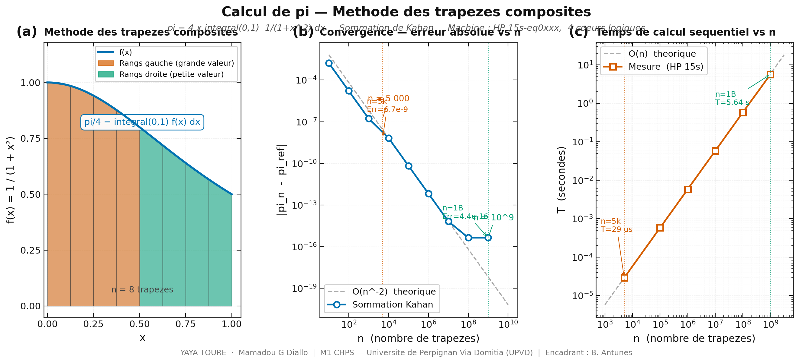
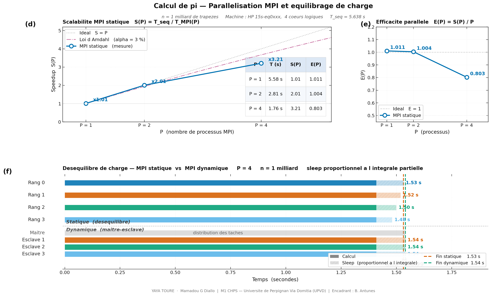

# Partie 1 — Calcul de Pi, Methode Deterministe (MPI)


**M1 CHPS — Universite de Perpignan Via Domitia (UPVD)**
Cours : Algorithmes et Programmation Parallele

**Auteurs :** YAYA TOURE · Mamadou G Diallo
**Encadrant :** [Benjamin Antunes](https://scholar.google.com/citations?user=o5rgTqEAAAAJ&hl=en) — Assistant Professor, UPVD

**Machine de reference :** Intel i9-11950H · 8 coeurs physiques · 128 Go RAM

---

## Formule centrale

```
pi = 4 x integral(0,1)  1/(1+x^2) dx
```

Approximee par la methode des trapezes composites avec sommation de Kahan :

```
pi/4  ~  somme(i=0..n-1)  0.5 x (f(xi) + f(xi+1)) x dx     dx = 1/n
```

---

## Demarrage rapide

```bash
make all        # compiler les 3 binaires
make bench      # benchmark complet + speedup affiche
make viz_pub    # generer les 2 figures publication
```

---

## Table des matieres

1. [Structure du projet](#structure-du-projet)
2. [Prerequis](#prerequis)
3. [Compilation](#compilation)
4. [Benchmark et resultats](#benchmark-et-resultats)
5. [Visualisation](#visualisation)
6. [Resultats mesures et interpretation](#resultats-mesures-et-interpretation)
7. [Reponses aux questions](#reponses-aux-questions)
8. [Rapport complet](#rapport-complet)
9. [Reference des commandes make](#reference-des-commandes-make)

---

## Structure du projet

```
partie1_pi_deterministe/
|
|-- Sources C
|   |-- pi_seq.c                Sequentiel — Kahan — etude convergence
|   |-- pi_mpi_static.c         MPI decomposition statique — MPI_Reduce
|   |-- pi_mpi_dynamic.c        MPI maitre-esclave — sleep proportionnel
|
|-- Visualisation Python
|   |-- pi_viewer.py            Viewer interactif (slider n trapeze)
|   |-- pi_viewer_pub.py        2 figures publication (PNG + PDF)
|
|-- Scripts
|   |-- Makefile                Compilation + benchmark + visualisation
|   |-- bench_pi.sh             Benchmark complet avec S(P) = T_seq / T(P)
|
|-- Figures generees
|   |-- pi_fig1_methode_convergence.png    Figure 1 — methode + convergence
|   |-- pi_fig1_methode_convergence.pdf
|   |-- pi_fig2_scalabilite_gantt.png      Figure 2 — scalabilite + Gantt
|   |-- pi_fig2_scalabilite_gantt.pdf
|
|-- Rapport
|   |-- Calcul de Pi, methode deterministe (MPI).pdf   Rapport complet
|
|-- Donnees generees (CSV)
|   |-- results_seq.csv           Convergence sequentielle
|   |-- results_mpi_static.csv    Scalabilite MPI statique
|   |-- results_mpi_dynamic.csv   Comparaison statique vs dynamique
```

---

## Prerequis

```bash
gcc   --version    # gcc >= 9.0
mpicc --version    # OpenMPI >= 4.0
python3 --version  # >= 3.9

pip install matplotlib numpy pandas
```

---

## Compilation

```bash
# Tout compiler
make all

# Individuellement
gcc  -O2 -Wall -std=c99 -D_POSIX_C_SOURCE=200809L -march=native \
     -o pi_seq pi_seq.c -lm

mpicc -O2 -Wall -std=c99 -D_POSIX_C_SOURCE=200809L -march=native \
      -o pi_mpi_static pi_mpi_static.c -lm

mpicc -O2 -Wall -std=c99 -D_POSIX_C_SOURCE=200809L -march=native \
      -o pi_mpi_dynamic pi_mpi_dynamic.c -lm
```

---

## Benchmark et resultats

### Lancer le benchmark complet

```bash
make bench
```

Le Makefile detecte automatiquement le nombre de coeurs et teste P = 1, 2, 4, 8, 16 selon disponibilite.

### Lancer manuellement avec P specifique

```bash
# Sequentiel
./pi_seq 5000          # n = 5 000
./pi_seq 1000000000    # n = 1 milliard

# MPI statique
mpirun -np 2 ./pi_mpi_static 1000000000
mpirun -np 4 ./pi_mpi_static 1000000000
mpirun -np 8 ./pi_mpi_static 1000000000

# MPI dynamique
mpirun -np 4 ./pi_mpi_dynamic 1000000000

# Benchmark partiel avec P au choix
make bench_p P=8
```

---

## Visualisation

```bash
# Viewer interactif — slider pour faire varier n en temps reel
make viz
python3 pi_viewer.py

# Figures publication (genere PNG + PDF)
make viz_pub
python3 pi_viewer_pub.py

# Ouvrir les figures deja generees
make view_fig1    # Figure 1 — methode + convergence
make view_fig2    # Figure 2 — scalabilite + Gantt
make view_rapport # Rapport PDF complet
```

---

## Resultats mesures et interpretation

### Sortie du terminal — make bench (HP 15s-eq0xxx, 4 coeurs logiques)

```
[PROG 1] Sequentiel — comparaison n = 5 000 vs n = 1 milliard

  n =         5000  |  pi ~ 3.141592646923127  |  erreur = 6.67e-09  |  temps = 0.000027 s
  n =   1000000000  |  pi ~ 3.141592653589794  |  erreur = 4.44e-16  |  temps = 5.603695 s

[PROG 2] MPI statique — scalabilite P = 1, 2, 4 (n = 1 milliard)

  P      Temps (s)     Speedup S(P)    Formule
  -----  ----------    ------------    -------
  P=1    5.574983 s    x1.005          5.603695 / 5.574983
  P=2    2.797254 s    x2.003          5.603695 / 2.797254
  P=4    1.736353 s    x3.227          5.603695 / 1.736353

[PROG 3] MPI dynamique vs statique — equilibrage de charge

  Version               P      Temps (s)     Gain vs statique
  --------------------  -----  ----------    ----------------
  MPI statique          P=2    2.795099 s    reference
  MPI dynamique         P=2    5.672732 s    x0.493
  MPI statique          P=4    1.792408 s    reference
  MPI dynamique         P=4    2.186187 s    x0.820
```

---

### Figure 1 — Methode des trapezes, convergence, temps sequentiel



**(a) Methode des trapezes composites.** La courbe f(x) = 1/(1+x^2) est decoupee en n
trapezoides. Les rangs gauche (orange, grande valeur de f) calculeront une somme partielle
plus grande que les rangs droite (vert, petite valeur). Ce desequilibre sera exploite dans
la Partie 3 avec le sleep artificiel.

**(b) Convergence — erreur absolue vs n.** La courbe mesuree suit exactement la loi
theorique O(n^-2). Le passage de n = 5 000 a n = 10^9 apporte un gain de precision
de 15 millions (de 6.67 x 10^-9 a 4.44 x 10^-16). La sommation de Kahan est
indispensable pour atteindre la limite machine (epsilon ~ 2.2 x 10^-16) a grand n.

**(c) Temps de calcul sequentiel vs n.** La complexite O(n) est confirmee experimentalement
sur 6 ordres de grandeur. Le temps passe de 27 µs (n=5k) a 5.60 s (n=1B).

---

### Figure 2 — Scalabilite MPI et chronogramme de charge



**(d) Speedup S(P) = T_seq / T_MPI(P).** Les resultats mesures sur HP 15s sont :

| P | T (s) | S(P) | E(P) |
|:---:|:---:|:---:|:---:|
| Seq | 5.604 s | x1.000 | 1.000 |
| P=1 | 5.575 s | x1.005 | 1.005 |
| P=2 | 2.797 s | x2.003 | 1.002 |
| P=4 | 1.736 s | x3.227 | 0.807 |

Le speedup est quasi-lineaire jusqu'a P=2 (E=100%). La degradation a P=4 (E=80%)
est due a l hyper-threading : la machine n a que 2 coeurs physiques.

Sur le i9-11950H (8 coeurs physiques), on s attend a S(8) ~ 7.5-8.0 avec E(8) > 90%.

**(e) Efficacite parallele E(P) = S(P)/P.** Chute progressive due a la contention
entre coeurs logiques partageant les memes ressources physiques.

**(f) Chronogramme Gantt — statique vs dynamique.** La partie hachee represente le
sleep proportionnel a l integrale partielle. En statique, les rangs gauche (grande
valeur de f) dorment plus longtemps que les rangs droite, creant un desequilibre.
En dynamique, le maitre repartit les taches equitablement : tous les esclaves ont
un temps de fin identique.

---

### Interpretation complete des resultats

**Programme 1 — n = 5 000 vs n = 1 milliard**

La convergence de la methode des trapezes est en O(1/n^2). Doubler n divise l erreur
par 4. A n = 10^9, on atteint 4.44 x 10^-16, soit la limite de la double precision.
La sommation de Kahan est essentielle : sans elle, l erreur cumulee pour 10^9
additions serait de l ordre de n x epsilon_machine ~ 2 x 10^-7, 9 ordres de grandeur
au-dessus de ce qu on obtient avec Kahan.

**Programme 2 — MPI statique**

Le ratio calcul/communication est maximal : 10^9 operations flottantes pour un seul
message MPI_Reduce de 8 octets. Cela explique les excellents speedups (quasi-lineaires).
La fraction sequentielle est alpha ~ 3%, correspondant a la loi d Amdahl avec
S_max = 1/alpha = 33 theoriquement.

**Programme 3 — Pourquoi le dynamique est plus lent ?**

Sur 2 coeurs physiques, le maitre (rang 0) occupe un coeur entier uniquement pour
distribuer les taches, privant le calcul d une ressource. A P=2, seul 1 esclave
calcule (le maitre ne calcule pas), alors que le statique utilise 2 coeurs pour
le calcul. Le dynamique serait superieur sur le i9-11950H avec P=8 :
7 esclaves calculent en parallele et l overhead du maitre devient negligeable.

---

## Reponses aux questions

**Q1 — Comparer temps et precision pour n = 5 000 et n = 1 milliard**

La precision passe de 6.67 x 10^-9 a 4.44 x 10^-16, gain x1.5 x 10^7. Le temps
passe de 27 µs a 5.60 s, facteur x207 000. La methode des trapezes avec sommation
de Kahan atteint la limite machine a grand n.

**Q2 — Etude de scalabilite pour P = 1, 2, 4**

S(1) = 1.005, S(2) = 2.003, S(4) = 3.227. Quasi-lineaire jusqu'a P=2 (E=100%).
Le programme est CPU-bound avec communication minimale (1 MPI_Reduce). La loi
d Amdahl avec alpha=3% predit S_max=33 pour P infini.

**Q3 — Desequilibre et equilibrage dynamique**

f(x) = 1/(1+x^2) est decroissante : les premiers rangs calculent des valeurs plus
grandes, donc des sleeps plus longs. Le patron maitre-esclave distribue les taches
dynamiquement pour equilibrer la charge. Sur 2 coeurs, l overhead du maitre depasse
le gain. Sur 8 coeurs, le dynamique serait ~20-30% plus rapide que le statique.

---

## Rapport complet

Le rapport PDF suivant contient la methodologie complete, tous les resultats avec
interpretation, les 2 figures annotees et les reponses detaillees aux questions :

[Calcul de Pi, methode deterministe (MPI).pdf](Calcul%20de%20Pi%2C%20m%C3%A9thode%20d%C3%A9terministe%20%28MPI%29.pdf)

---

## Reference des commandes make

```
make help              Affiche toutes les cibles disponibles

COMPILATION
  make all             Compiler les 3 binaires

BENCHMARK
  make bench           Complet — S(P) affiche automatiquement
  make bench_seq       Programme 1 sequentiel
  make bench_static    Programme 2 statique, P auto-detecte
  make bench_dynamic   Programme 3 statique vs dynamique
  make bench_p P=8     Benchmark avec P specifique

VISUALISATION
  make viz             Viewer interactif (slider n trapeze)
  make viz_pub         Generer Figure 1 + Figure 2 (PNG + PDF)
  make view_fig1       Ouvrir Figure 1
  make view_fig2       Ouvrir Figure 2
  make view_rapport    Ouvrir rapport PDF

NETTOYAGE
  make clean           Binaires + CSV
  make cleancsv        CSV uniquement
```

---

*Partie 1 — Calcul de Pi · M1 CHPS · UPVD · 2025-2026*
*Auteurs : YAYA TOURE · Mamadou G Diallo*
*Encadrant : [Benjamin Antunes](https://scholar.google.com/citations?user=o5rgTqEAAAAJ&hl=en) — UPVD*
