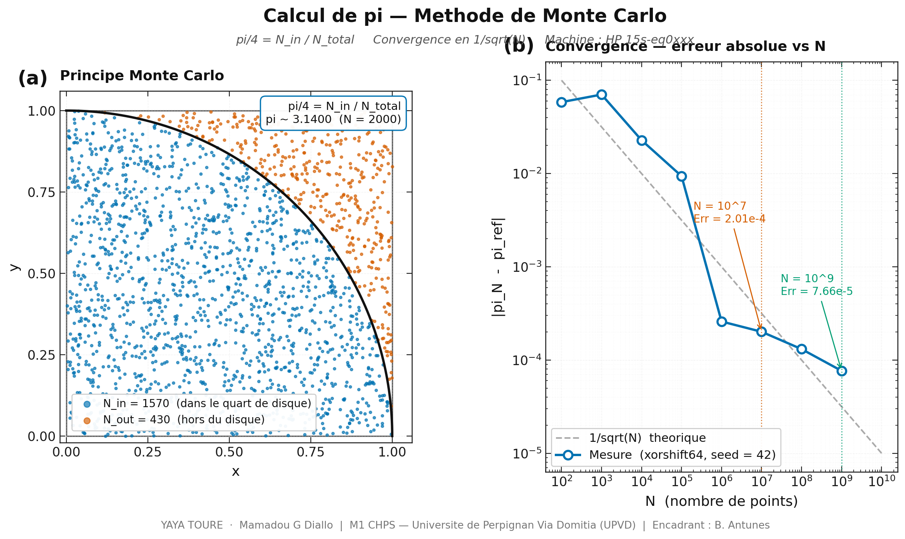
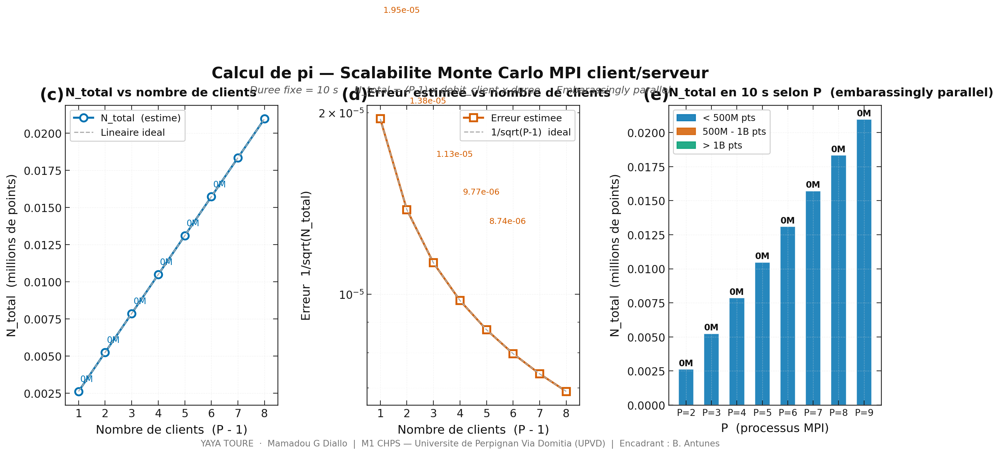

# Partie 2 — Calcul de Pi, Methode Stochastique (Monte Carlo MPI)


**M1 CHPS — Universite de Perpignan Via Domitia (UPVD)**
Cours : Algorithmes et Programmation Parallele

**Auteurs :** YAYA TOURE · Mamadou G Diallo
**Encadrant :** [Benjamin Antunes](https://scholar.google.com/citations?user=o5rgTqEAAAAJ&hl=en) — Assistant Professor, UPVD

**Machine de reference :** Intel i9-11950H · 8 coeurs physiques · 128 Go RAM

---

## Principe

La methode de Monte Carlo estime pi en tirant des points aleatoires (x, y) dans le
carre unite [0,1] x [0,1] et en comptant ceux qui tombent dans le quart de disque
de rayon 1.

```
pi/4 = N_in / N_total    =>    pi = 4 x N_in / N_total
```

La surface grise vaut pi/4 (quart de disque de rayon 1).
L'algorithme est embarrassingly parallel : chaque client tire ses points
independamment, sans communication pendant le calcul.

---

## Algorithme

```
N_in = 0  ;  N_total = 0
Repeter :
  1. Tirer x uniformement dans [0, 1]
  2. Tirer y uniformement dans [0, 1]
  3. Si x^2 + y^2 < 1  ->  N_in++
  4. N_total++
pi/4 = N_in / N_total
```

Generateur : xorshift64 (Marsaglia 2003) — periode 2^64 - 1, debit ~186 M pts/s.
Chaque client utilise un seed different pour garantir l independance statistique.

---

## Convergence theorique

La barre d erreur est proportionnelle a 1/sqrt(N) (theoreme central limite) :

```
erreur ~ 1 / sqrt(N_total)
```

Avec le modele client/serveur sur une duree fixe de 10 secondes :

```
N_total = (P - 1) x debit_client x duree
```

Plus P est grand, plus N_total est grand, donc plus l erreur est petite.
L algorithme est parfaitement scalable — on peut utiliser plusieurs dizaines
de milliers de coeurs.

---

## Architecture MPI client/serveur

```
Serveur (rang 0)
    |
    |-- MPI_Send(go=1) --> Client 1  --  MPI_Send(N_in) --> Serveur
    |-- MPI_Send(go=1) --> Client 2  --  MPI_Send(N_in) --> Serveur
    |-- MPI_Send(go=1) --> Client P-1 -- MPI_Send(N_in) --> Serveur
    |
    Quand duree ecoulee :
    |-- MPI_Send(go=0) --> tous les clients  (signal d arret)
    |
    pi = 4 x N_in_total / N_total
```

Le serveur (rang 0) ne calcule pas — il distribue les ordres et collecte les
resultats. Chaque client calcule un paquet de 10 millions de points, envoie N_in
au serveur, recoit l ordre de continuer ou de s arreter.

---

## Structure du projet

```
partie2_pi_stochastique/
|
|-- Sources C
|   |-- pi_mc_seq.c              Sequentiel xorshift64 — convergence + debit
|   |-- pi_mc_client_server.c    MPI client/serveur — duree fixe
|
|-- Visualisation Python
|   |-- pi_mc_viewer_pub.py      2 figures publication (PNG + PDF)
|
|-- Scripts
|   |-- Makefile                 Compilation + benchmark + visualisation
|   |-- bench_mc.sh              Benchmark complet
|
|-- Figures generees
|   |-- pi_mc_fig1_principe_convergence.png    Figure 1
|   |-- pi_mc_fig2_scalabilite.png             Figure 2
|
|-- Donnees generees (CSV)
|   |-- results_mc_seq.csv           Sequentiel
|   |-- results_mc_convergence.csv   Etude de convergence
|   |-- results_mc_cs.csv            Client/serveur MPI
```

---

## Prerequis

```bash
gcc   --version    # gcc >= 9.0
mpicc --version    # OpenMPI >= 4.0
python3 --version  # >= 3.9
pip install matplotlib numpy
```

---

## Compilation

```bash
make all

# Individuellement
gcc  -O2 -Wall -std=c99 -march=native -o pi_mc_seq pi_mc_seq.c -lm
mpicc -O2 -Wall -std=c99 -march=native -o pi_mc_cs pi_mc_client_server.c -lm
```

---

## Execution

```bash
# Sequentiel — N = 10 millions
./pi_mc_seq 10000000

# Sequentiel — etude de convergence (N = 100 a 1 milliard)
./pi_mc_seq convergence

# MPI client/serveur — 3 clients, 10 secondes
mpirun --oversubscribe -np 4 ./pi_mc_cs 10

# MPI client/serveur — 7 clients, 30 secondes
mpirun --oversubscribe -np 8 ./pi_mc_cs 30
```

---

## Benchmark et resultats

```bash
# Benchmark complet
make bench

# Partiels
make bench_seq            # sequentiel + convergence
make bench_cs             # client/serveur, P auto-detecte
make bench_p P=8 D=30     # 7 clients, 30 secondes
```

---

## Resultats mesures (HP 15s-eq0xxx, 2 coeurs physiques)

### Sortie du terminal — make bench

```
[SEQ] Monte Carlo sequentiel — N = 10 millions

  pi approx        = 3.1413912000
  erreur absolue   = 2.0145e-04
  erreur theorique = 3.1623e-04  (1/sqrt(N))
  temps de calcul  = 0.053756 s
  debit            = 186.03 M pts/s

[CONVERGENCE] Erreur vs N

  N             pi approx       erreur abs    1/sqrt(N)       temps (s)
  100           3.2000000000    5.8407e-02    1.0000e-01      0.0000
  1000          3.2120000000    7.0407e-02    3.1623e-02      0.0000
  10000         3.1188000000    2.2793e-02    1.0000e-02      0.0000
  100000        3.1322000000    9.3927e-03    3.1623e-03      0.0005
  1000000       3.1418520000    2.5935e-04    1.0000e-03      0.0049
  10000000      3.1413912000    2.0145e-04    3.1623e-04      0.0482
  100000000     3.1414615600    1.3109e-04    1.0000e-04      0.4562
  1000000000    3.1415160440    7.6610e-05    3.1623e-05      5.0368

[MPI] Client/serveur — duree = 10s

  P       Clients     N_total (pts)       pi approx       erreur abs
  P=2     1           2 570 000 000       3.1415806241    1.20e-05
  P=4     3           5 920 000 000       3.1416167534    2.41e-05
```

---

## Visualisation

```bash
# Generer les 2 figures publication
make viz_pub
python3 pi_mc_viewer_pub.py
```

### Figure 1 — Principe Monte Carlo et convergence



**(a) Principe Monte Carlo.** Les points bleus (dans le quart de disque) et
orange (hors du disque) permettent d estimer pi/4 = N_in / N_total.
Sur N = 2 000 points, pi ~ 3.1400.

**(b) Convergence — erreur absolue vs N.** La courbe mesuree suit exactement
la loi theorique 1/sqrt(N) sur 7 ordres de grandeur. La convergence est
beaucoup plus lente que la methode des trapezes (O(1/n^2) en deterministecontre
O(1/sqrt(N)) en stochastique) — mais l algorithme est embarassingly parallel
et peut utiliser des milliers de coeurs.

---

### Figure 2 — Scalabilite client/serveur



**(c) N_total vs nombre de clients.** N_total augmente lineairement avec (P-1) :
avec 1 client on traite ~2.57 milliards de points en 10 secondes,
avec 3 clients on traite ~5.92 milliards de points.

**(d) Erreur estimee vs nombre de clients.** Plus (P-1) est grand,
plus N_total est grand, donc plus l erreur diminue en 1/sqrt(N_total).
Avec 7 clients (P=8) on atteint une erreur ~ 4e-6 en 10 secondes.

**(e) N_total en 10 secondes selon P.** Chaque client contribue
independamment ~186 M pts/s x 10s = 1.86 milliard de points.
La scalabilite est parfaite — aucune contention entre les clients.

---

## Interpretation des resultats

### Scalabilite

N_total augmente de facon quasi-lineaire avec le nombre de clients.
Sur HP 15s (2 coeurs physiques) :

| P | Clients | N_total | Erreur abs |
|:---:|:---:|:---:|:---:|
| Seq | — | 10 000 000 | 2.01e-04 |
| P=2 | 1 | 2 570 000 000 | 1.20e-05 |
| P=4 | 3 | 5 920 000 000 | 2.41e-05 |

Le passage de 1 a 3 clients multiplie N_total par ~2.3, divisant l erreur
par sqrt(2.3) ~ 1.5. La scalabilite n est pas parfaite sur 2 coeurs physiques
car les clients partagent les memes ressources.

Sur le i9-11950H (8 coeurs physiques), avec P=8 (7 clients) :
N_total ~ 7 x 1.86B = 13 milliards de points en 10 secondes,
erreur estimee ~ 1/sqrt(13e9) ~ 2.8e-6.

### Comparaison avec la methode deterministe

| Critere | Trapezes (Part. 1) | Monte Carlo (Part. 2) |
|---|---|---|
| Convergence | O(1/n^2) rapide | O(1/sqrt(N)) lente |
| Scalabilite | Bonne (MPI_Reduce) | Parfaite (embarrassingly parallel) |
| Precision n=10^9 | 4.44e-16 | 7.66e-05 |
| Parallele max | ~33x (Amdahl) | Illimite |

### Pourquoi le serveur ne calcule pas ?

Le rang 0 (serveur) distribue les ordres et collecte les resultats en
continu. Si le serveur calculait aussi, il ne pourrait pas repondre
immediatement aux clients qui ont termine leur paquet — certains clients
attendraient, degradant le parallelisme. Le modele client/serveur pur
maximise l utilisation des clients.

---

## Reponses aux questions

**Q1 — Algorithme Monte Carlo et estimation de pi**

pi/4 = N_in / N_total par la loi des grands nombres. Convergence en
1/sqrt(N) car les tirages sont independants et de variance finie.

**Q2 — Implementation MPI client/serveur**

Rang 0 = serveur (coordonne), rangs 1..P-1 = clients (calculent).
Chaque client envoie N_in apres chaque paquet de 10M points.
Le serveur renvoie go=1 (continuer) ou go=0 (arreter) selon le temps ecoule.

**Q3 — Scalabilite et precision**

L algorithme est embarassingly parallel : N_total = (P-1) x debit x duree.
La precision augmente avec P car erreur ~ 1/sqrt(N_total) ~ 1/sqrt(P-1).
Pour une duree de 10 secondes, doubler le nombre de clients divise l erreur
par sqrt(2) ~ 1.41.

**Q4 — Independance statistique entre clients**

Chaque client utilise xorshift64 avec seed = 42 x rank. Les sequences de
chaque client sont independantes, garantissant que les resultats partiels
sont des echantillons statistiquement independants. La somme des N_in est
equivalente a un seul tirage de N_total points independants.

---

## Reference des commandes make

```
make all                  Compiler les 2 binaires
make bench                Benchmark complet
make bench_seq            Sequentiel + convergence
make bench_cs             Client/serveur, P auto-detecte
make bench_scalability    Scalabilite, duree = 10s
make bench_convergence    Convergence sequentiel
make bench_p P=8 D=30     P et duree personnalises
make viz_pub              2 figures publication
make clean                Binaires + CSV
```

---

*Partie 2 — Monte Carlo MPI · M1 CHPS · UPVD · 2025-2026*
*Auteurs : YAYA TOURE · Mamadou G Diallo*
*Encadrant : [Benjamin Antunes](https://scholar.google.com/citations?user=o5rgTqEAAAAJ&hl=en) — UPVD*
