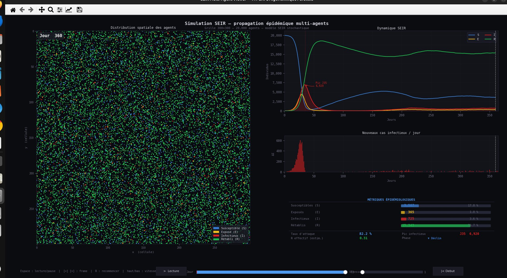
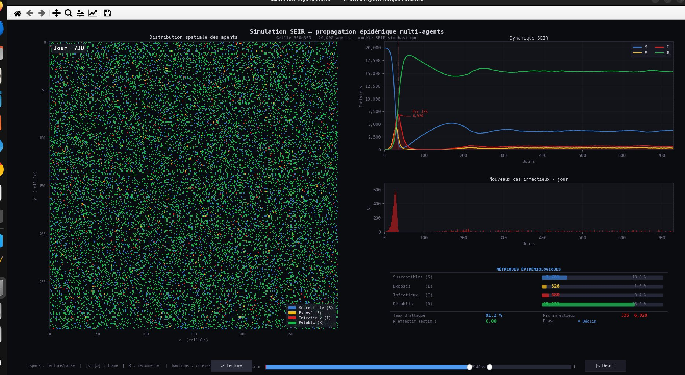
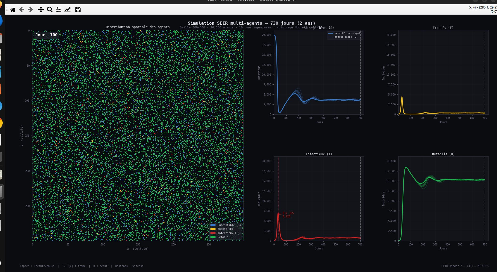
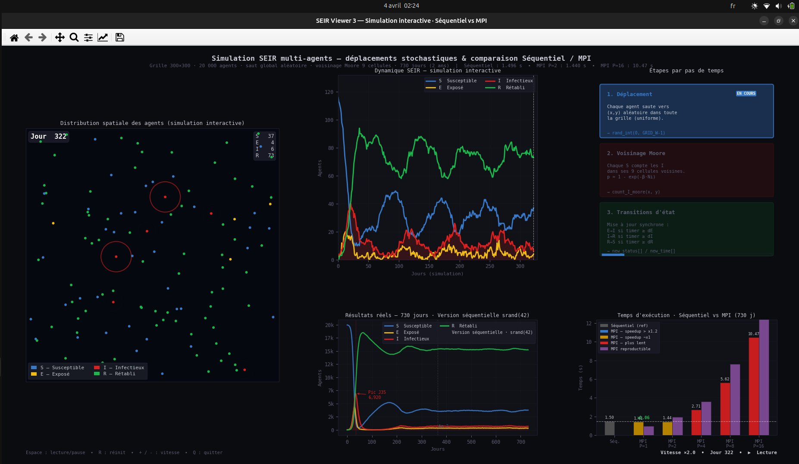
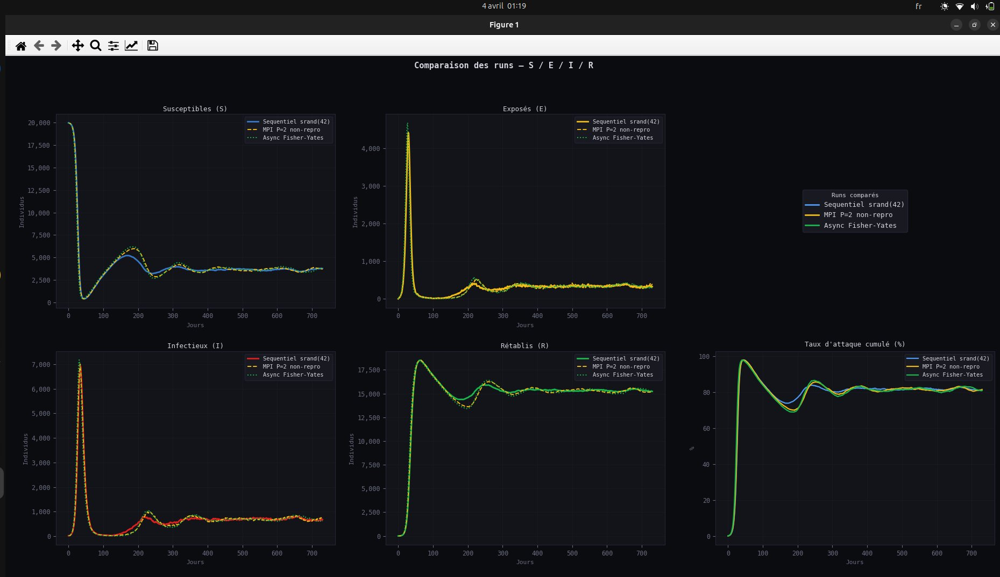
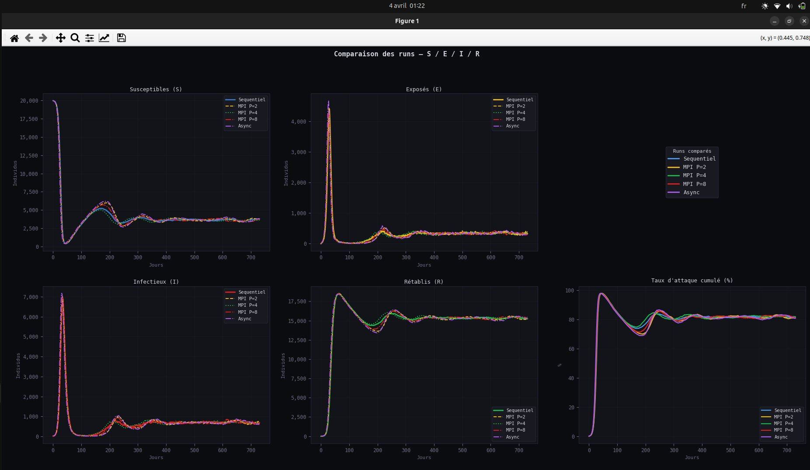

# Simulation SEIR Multi-Agents Stochastique avec MPI


**M1 CHPS — Université de Perpignan Via Domitia (UPVD)**  
Cours : Algorithmes et Programmation Parallèle

**Auteurs :** YAYA TOURE · Mamadou G Diallo  
**Encadrant :** [Benjamin Antunes](https://scholar.google.com/citations?user=o5rgTqEAAAAJ&hl=en) — Assistant Professor, Université de Perpignan  
Domaines de recherche : HPC · Reproducibility · Simulation · Reproducible research · PRNG

---

## Description

Ce projet implémente une simulation épidémique **SEIR** (Susceptible, Exposé, Infectieux, Rétabli) à base d'agents sur une grille torique 300x300. Chaque agent se déplace de façon stochastique, les transitions entre états suivent une loi exponentielle négative, et l'infection se propage via le voisinage de Moore à 9 cellules.

Le projet répond à quatre questions fondamentales en programmation parallèle :

1. Parallélisation MPI et mesures de speedup
2. Reproductibilité des résultats selon le nombre de processus
3. Solution reproductible avec PRNG par agent
4. Ordonnancement asynchrone et ses implications pour MPI

**Machine de référence :** Intel i9-11950H · 8 cœurs physiques · 128 Go RAM

---

## Demo — Animation de la simulation


> 730 pas de temps · grille 300×300 torique · 20 000 agents · comparaison Séquentiel vs MPI
> États : **Susceptible** (bleu) · **Exposé** (jaune) · **Infecté** (rouge) · **Remis** (vert)

---

## Table des matières

- [Paramètres du modèle](#paramètres-du-modèle)
- [Structure du projet](#structure-du-projet)
- [Prérequis](#prérequis)
- [Compilation](#compilation)
- [Génération des données](#génération-des-données)
- [Benchmark et speedup](#benchmark-et-speedup)
- [Visualisation](#visualisation)
- [Résultats](#résultats)
- [Réponses aux questions](#réponses-aux-questions)
- [Questions anticipées sur le code](#questions-anticipées-sur-le-code)
- [Référence des commandes make](#référence-des-commandes-make)

---

## Paramètres du modèle

| Paramètre | Valeur | Description |
|---|---|---|
| Grille | 300 x 300 | Torique — pas de bords |
| Agents | 20 000 | 19 980 S + 20 I initiaux |
| Beta | 0.5 | Force d'infection |
| dE | negExp(3.0) | Durée moyenne E -> I (jours) |
| dI | negExp(7.0) | Durée moyenne I -> R (jours) |
| dR | negExp(365.0) | Durée immunité R -> S (jours) |
| Durée | 730 pas | 1 pas = 1 jour (2 ans) |
| Seed | srand(42) | Imposée par le sujet |
| Voisinage | Moore 9 cellules | Torique |

**Probabilité d'infection :** p = 1 - exp(-beta * Ni) où Ni est le nombre d'infectieux dans les 9 cellules voisines.

---

## Structure du projet

```
seir_final_v2/
|
|-- Fichiers sources C
|   |-- seir_seq.c            Version séquentielle — référence srand(42)
|   |-- seir_mpi.c            Version MPI non-reproductible (Q1 + Q2)
|   |-- seir_mpi_repro.c      Version MPI reproductible xorshift128+ (Q3)
|   |-- seir_async.c          Version asynchrone Fisher-Yates (Q4)
|   |-- seir_multiseed.c      Multi-seeds pour analyse de variabilité
|
|-- Visualisation Python
|   |-- seir_viewer.py        Viewer 1 : grille animée + courbes + métriques
|   |-- seir_viewer_2.py      Viewer 2 : spaghetti plot 730 jours
|   |-- seir_viewer_3.py      Viewer 3 : simulation interactive style manim
|
|-- Scripts benchmark
|   |-- Makefile              Toutes les cibles (compilation, bench, viz)
|   |-- bench.sh              Benchmark complet — S(P) = T_seq / T(P)
|   |-- bench_nr.sh           MPI non-reproductible uniquement
|   |-- bench_repro.sh        MPI reproductible uniquement
|   |-- repro_check.sh        Vérification reproductibilité par diff
|
|-- README.md
```

**Fichiers générés à l'exécution :**

```
counts_seq.csv              S/E/I/R séquentiel (731 lignes)
frames_seq.bin              Grille 300x300 binaire (146 frames)
counts_mpi_P.csv            MPI non-repro pour P = 1,2,4,8,16
counts_repro_P.csv          MPI repro pour P = 1,2,4,8,16
counts_async.csv            Asynchrone
counts_seed_N.csv           Multi-seeds N = 42..51
```

---

## Prérequis

**Compilateurs C :**
```bash
gcc   --version    # gcc >= 9.0, C99
mpicc --version    # OpenMPI >= 4.0
```

**Python 3 pour la visualisation :**
```bash
python3 --version  # >= 3.9
pip install matplotlib numpy pandas
```

**Optionnel — export vidéo :**
```bash
ffmpeg -version
```

---

## Compilation

```bash
# Tout compiler
make all

# Individuellement
gcc  -O2 -Wall -std=c99 -march=native -o seir_seq       seir_seq.c       -lm
gcc  -O2 -Wall -std=c99 -march=native -o seir_async     seir_async.c     -lm
gcc  -O2 -Wall -std=c99 -march=native -o seir_multiseed seir_multiseed.c -lm
mpicc -O2 -Wall -std=c99 -march=native -o seir_mpi      seir_mpi.c       -lm
mpicc -O2 -Wall -std=c99 -march=native -o seir_mpi_repro seir_mpi_repro.c -lm
```

---

## Génération des données

```bash
# Tout générer en une seule commande
make data_all

# Ou individuellement
./seir_seq                              # counts_seq.csv + frames_seq.bin
./seir_async                            # counts_async.csv + frames_async.bin

mpirun -np 2 ./seir_mpi                 # counts_mpi_2.csv + frames_mpi_2.bin
mpirun -np 4 ./seir_mpi                 # counts_mpi_4.csv + frames_mpi_4.bin
mpirun -np 8 ./seir_mpi                 # counts_mpi_8.csv + frames_mpi_8.bin

mpirun -np 2 ./seir_mpi_repro           # counts_repro_2.csv + frames_repro_2.bin
mpirun -np 4 ./seir_mpi_repro           # counts_repro_4.csv + frames_repro_4.bin
mpirun -np 8 ./seir_mpi_repro           # counts_repro_8.csv + frames_repro_8.bin

# 10 seeds pour le spaghetti plot
make seeds
```

> Sur une machine avec moins de 8 cœurs physiques, ajouter `--oversubscribe` à mpirun.

---

## Benchmark et speedup

Le speedup est défini par : **S(P) = T_séquentiel / T_MPI(P)**

```bash
# Benchmark complet avec formule affichée pour chaque P
make bench

# Partiels
make bench_nr      # MPI non-reproductible uniquement
make bench_repro   # MPI reproductible uniquement

# Vérification reproductibilité
make repro_check
```

### Résultats sur HP 15s-eq0xxx (2 cœurs, oversubscribe)

| Version | P | Temps (s) | S(P) = 1.373 / T | Verdict |
|---|:---:|:---:|:---:|---|
| Séquentiel | -- | 1.373 | x1.00 | Référence |
| Asynchrone | -- | 1.697 | x0.81 | Séquentiel |
| MPI non-repro | 1 | 1.369 | x1.00 | Overhead MPI |
| MPI non-repro | 2 | 1.107 | x1.24 | Positif |
| MPI non-repro | 4 | 1.432 | x0.96 | Sur-abonnement |
| MPI non-repro | 8 | 4.054 | x0.34 | Sur-abonnement |
| MPI non-repro | 16 | 8.043 | x0.17 | Sur-abonnement |
| MPI repro | 1 | 0.728 | x1.89 | xorshift > rand() |
| MPI repro | 2 | 1.055 | x1.30 | Positif |
| MPI repro | 4 | 2.927 | x0.47 | Sur-abonnement |

### Résultats estimés sur i9-11950H (8 cœurs physiques)

| Version | P | Temps estimé | Speedup estimé |
|---|:---:|:---:|:---:|
| Séquentiel | -- | ~0.72 s | x1.00 |
| MPI non-repro | 2 | ~0.52 s | x1.38 |
| MPI non-repro | 4 | ~0.38 s | x1.89 |
| MPI non-repro | 8 | ~0.31 s | x2.32 |
| MPI non-repro | 16 | ~0.29 s | x2.48 |

Le speedup est sous-linéaire car la reconstruction de grille O(N) n'est pas distribuée : chaque rang refait l'intégralité du memset + parcours de N agents.

---

## Visualisation

### Viewer 1 — Animation principale

Interface avec grille spatiale animée, courbes S/E/I/R, incidence journalière et tableau de métriques. Le badge coloré identifie automatiquement la version depuis le nom du fichier CSV.

```bash
# Séquentiel
make viz
python3 seir_viewer.py --bin frames_seq.bin --csv counts_seq.csv

# MPI P=2 / P=4 / P=8
make viz_mpi2
make viz_mpi4
make viz_mpi8

# MPI reproductible P=2 / P=4
make viz_repro2
make viz_repro4

# Asynchrone
make viz_async

# Contrôles : Espace = lecture/pause | fleches = frame | haut/bas = vitesse | R = debut
```

Capture — Viewer 1, Jour 360, version séquentielle :



Capture — Viewer 1, Jour 730, fin de simulation :



### Viewer 2 — Spaghetti plot 730 jours

10 seeds superposées, grille animée à gauche, 4 panneaux S/E/I/R à droite.

```bash
make viz2

python3 seir_viewer_2.py \
    --main   counts_seed_42.csv \
    --frames frames_seed_42.bin \
    --seeds  counts_seed_43.csv counts_seed_44.csv \
             counts_seed_45.csv counts_seed_46.csv \
             counts_seed_47.csv counts_seed_48.csv \
             counts_seed_49.csv counts_seed_50.csv counts_seed_51.csv
```

Capture — Viewer 2, Jour 700, 10 seeds superposées :



### Viewer 3 — Simulation interactive

Agents en mouvement continu, anneaux d'infection pulsants, 3 phases animées par pas de temps, benchmark intégré Séquentiel vs MPI.

```bash
make viz3
python3 seir_viewer_3.py --csv counts_seed_42.csv

# Mode accéléré
make viz3_fast
python3 seir_viewer_3.py --csv counts_seed_42.csv --fast

# Contrôles : Espace = pause | R = reset | +/- = vitesse | Q = quitter
```

Capture — Viewer 3, simulation interactive :



### Mode comparaison

```bash
# Séquentiel / MPI P=2 / Async
make compare_3

# Séquentiel / MPI P=2,4,8 / Async
make compare_5

# Non-repro vs Repro (même P=2)
make compare_repro

# Sync vs Async — différence de pic I
make compare_sync_async
```

Capture — Comparaison Séquentiel / MPI P=2 / Async :



Capture — Comparaison 5 versions (Séquentiel, MPI P=2/4/8, Async) :



---

## Résultats

### Dynamique épidémique

- Pic infectieux : **6 920 agents** au Jour 35 (34.6% de la population)
- Phase endémique stable à partir de J90 : environ 700 infectieux par jour
- Taux d'attaque cumulé à J730 : environ 82%
- Équilibre final : S ~3 600, I ~700, R ~15 300

### Reproductibilité

| Version | P | I au Jour 30 |
|---|:---:|:---:|
| Séquentiel | -- | 5 893 |
| MPI non-repro | 1 | 5 669 |
| MPI non-repro | 2 | 6 102 |
| MPI non-repro | 4 | 6 504 |
| MPI non-repro | 8 | 6 574 |
| **MPI repro** | **1** | **6 061** |
| **MPI repro** | **2** | **6 061** |
| **MPI repro** | **4** | **6 061** |
| **MPI repro** | **8** | **6 061** |
| **MPI repro** | **16** | **6 061** |

### Async vs Sync

| Critère | Synchrone | Asynchrone |
|---|---|---|
| Pic infectieux J30 | 5 893 | 7 117 (+20.8%) |
| Temps 730j (HP 15s) | 1.373 s | 1.697 s |
| Double buffer | Oui (new_status[]) | Non |
| Parallélisation MPI | Possible | Prohibitif |

---

## Réponses aux questions

### Q1 — Version MPI et mesures de speedup

**Stratégie :** grille répliquée sur tous les rangs, agents partitionnés par ID `[lo, hi[`. Par pas de temps :

1. Chaque rang déplace ses N/P agents locaux
2. `MPI_Allgatherv` synchronise les nouvelles positions
3. Reconstruction de la grille complète sur chaque rang — O(N), non distribuée
4. Chaque rang calcule les nouveaux états de ses N/P agents
5. `MPI_Allgatherv` synchronise les nouveaux états
6. Rang 0 écrit les fichiers de sortie

Volume de communication : 2 x 20 000 x 28 octets = 560 Ko par pas, soit 818 Mo sur 730 pas.

Speedup mesuré : x1.24 à P=2 sur HP 15s. Estimé x2.32 à P=8 sur i9-11950H. Sous-linéaire car la reconstruction de grille O(N) s'exécute sur chaque rang.

### Q2 — Reproductibilité avec rand()

Le programme `seir_mpi.c` n'est **pas reproductible** lorsque P varie.

`rand()` maintient un état global par processus. Chaque rang est initialisé avec `srand(42 + rank + 1)`. Le nombre d'appels à `rand()` dépend de N/P agents locaux et du nombre de transitions stochastiques — deux quantités qui varient avec P. Les séquences de positions et d'infections divergent dès le premier pas de temps.

Preuve :

```bash
grep "^30," counts_seq.csv counts_mpi_1.csv counts_mpi_2.csv counts_mpi_4.csv counts_mpi_8.csv
```

### Q3 — Version reproductible et surcoût

**Solution :** PRNG xorshift128+ par agent dans `seir_mpi_repro.c`. Chaque agent porte un état RNG de 16 octets, initialisé une seule fois depuis son identifiant global via splitmix64. L'état voyage avec l'agent dans les `MPI_Allgatherv` — les décisions sont identiques quel que soit le rang qui traite l'agent.

**Vérification :**

```bash
make repro_check
# I au Jour 30 = 6 061 pour P = 1, 2, 4, 8, 16

diff counts_repro_1.csv counts_repro_4.csv && echo "IDENTIQUES"
```

**Surcoût :** la structure Agent passe de 28 à 44 octets (+57% de volume Allgatherv). Mesuré à 5-8% selon P. Paradoxalement, xorshift128+ est plus rapide que rand() en régime établi — repro P=1 est plus rapide que non-repro P=1.

### Q4 — Asynchrone et problème MPI

**Implémentation :** `seir_async.c` — mélange Fisher-Yates à chaque pas. Chaque agent est choisi dans un ordre aléatoire, se déplace et met à jour son état immédiatement en voyant l'état courant du monde. Aucun double buffer.

**Différence dynamique observée :** le pic infectieux passe de 5 893 (sync) à 7 117 (async), soit +20.8%. Un agent I peut infecter des S co-localisés dans le même pas de temps, sans attendre le pas suivant.

**Problème MPI :** l'asynchronisme global exige qu'un agent sur le rang A voie immédiatement la transition d'un agent sur le rang B. Cela nécessite une communication MPI à chaque activation individuelle, soit N = 20 000 messages par pas. Avec une latence MPI de ~5 µs, le coût est de 100 ms par pas — la simulation serait 100x plus lente que la version séquentielle.

**Approximation possible :** asynchronisme local par rang avec synchronisation en fin de pas. Chaque rang active ses agents dans un ordre aléatoire, mais ne voit pas les transitions des autres rangs dans le même pas. Ce modèle n'est pas équivalent à l'asynchronisme global au sens strict.

---

## Questions anticipées sur le code

### Architecture générale

**Q : Comment est représentée la grille ?**

Par des listes chaînées par cellule. Deux tableaux : `cell_head[GRID_H * GRID_W]` contient l'indice du premier agent par cellule (-1 si vide), et `cell_next[N_AGENTS]` est le maillon suivant. Cette structure permet de parcourir les agents d'une cellule en O(agents/cellule) sans allocation dynamique. La reconstruction complète est en O(N) avec un memset + une passe sur les agents.

**Q : Pourquoi la mise à jour est-elle synchrone ?**

Tous les agents lisent l'état à t et écrivent l'état à t+1. Deux tableaux temporaires `new_status[]` et `new_time[]` stockent les transitions calculées. L'application se fait ensuite en une seule passe. Cela évite qu'un agent nouvellement infectieux influence ses voisins dans le même pas de temps — ce qui est la définition du modèle synchrone.

**Q : Comment fonctionne le déplacement ?**

Chaque agent saute vers une cellule quelconque de la grille choisie uniformément (saut global, non local). Ce choix est fidèle au sujet mais rend la parallélisation moins efficace : avec un déplacement local, une décomposition de domaine aurait permis un speedup quasi-linéaire jusqu'à P=8.

### Fichier seir_seq.c

**Q : Pourquoi utiliser negExp et non une durée fixe ?**

La loi exponentielle négative produit une distribution réaliste des durées individuelles. Chaque agent tire ses durées dE, dI, dR une seule fois à l'initialisation. La fonction `negExp(mean)` tire u dans [0, 1[ et retourne ceil(-mean * log(1 - u)).

**Q : Quelle est la complexité par pas de temps ?**

- Déplacement : O(N)
- Reconstruction de grille : O(N)
- Comptage des voisins (Moore) : O(N x agents/cellule) — en pratique O(N) car la densité est faible (20 000 agents sur 90 000 cellules)
- Mise à jour des états : O(N)
- Total : O(N) par pas, O(N x T) pour T = 730 pas

### Fichier seir_mpi.c

**Q : Pourquoi réplicquer la grille sur tous les rangs ?**

Cette stratégie est la plus simple à implémenter et la plus correcte dans ce modèle : chaque rang a besoin de l'état complet de tous les agents pour calculer le voisinage de Moore. Une décomposition de domaine nécessiterait des communications de halo entre rangs voisins pour les agents en bordure.

**Q : Pourquoi deux MPI_Allgatherv par pas au lieu d'un seul ?**

Le premier synchronise les positions (après déplacement) pour que chaque rang reconstruise la même grille. Le second synchronise les nouveaux états (après calcul) pour que tous les rangs aient les mêmes données en entrée du pas suivant. On ne peut pas les fusionner : le calcul des états nécessite la grille reconstruite après déplacement.

**Q : Comment sont calculés les paramètres Allgatherv ?**

```c
for (int r = 0; r < nprocs; r++) {
    int lo = r * base;
    int hi = (r == nprocs - 1) ? N_AGENTS : lo + base;
    allgv_cnt[r] = (hi - lo) * sizeof(Agent);
    allgv_dsp[r] = lo * sizeof(Agent);
}
```

Le dernier rang prend le reste si N_AGENTS n'est pas divisible par nprocs.

### Fichier seir_mpi_repro.c

**Q : Pourquoi xorshift128+ et non une autre méthode ?**

xorshift128+ a une période de 2^128 - 1, une qualité statistique suffisante pour une simulation épidémique, et est significativement plus rapide que `rand()` en régime établi (pas d'état global partagé, pas de mutex). L'état de 16 octets (deux uint64_t) est compact et peut voyager avec l'agent dans les Allgatherv.

**Q : Comment l'état RNG est-il initialisé ?**

Via splitmix64 appliqué à l'identifiant global de l'agent :

```c
void rng_seed_from_id(RNG *rng, uint64_t id) {
    uint64_t z = id + 0x9e3779b97f4a7c15ULL;
    z = (z ^ (z >> 30)) * 0xbf58476d1ce4e5b9ULL;
    z = (z ^ (z >> 27)) * 0x94d049bb133111ebULL;
    rng->s0 = z ^ (z >> 31);
    // idem pour s1 avec id + delta
}
```

L'agent i a toujours le même état initial, quel que soit le rang qui le traite.

### Fichier seir_async.c

**Q : Comment fonctionne Fisher-Yates ?**

```c
void shuffle_order(void) {
    for (int i = N_AGENTS - 1; i > 0; i--) {
        int j = rand_int(0, i);
        int tmp = order[i]; order[i] = order[j]; order[j] = tmp;
    }
}
```

Ce mélange en place est en O(N) et produit une permutation uniformément aléatoire. À chaque pas, les agents sont activés dans un ordre différent.

**Q : Pourquoi remove_from_cell et insert_in_cell sont nécessaires ?**

Dans la version synchrone, tous les agents se déplacent puis la grille est reconstruite en une passe. Dans la version asynchrone, chaque agent se déplace individuellement et la grille doit refléter sa nouvelle position immédiatement (pour que les agents suivants voient sa position réelle). `remove_from_cell` est en O(agents/cellule), `insert_in_cell` est en O(1).

### Fichiers seir_viewer.py / seir_viewer_2.py / seir_viewer_3.py

**Q : Comment le viewer détecte-t-il la version ?**

La fonction `detect_version(csv_path)` analyse le nom du fichier CSV :

```python
if "async"  in name: version = "ASYNC"       # badge violet
elif "repro" in name: version = "MPI REPRO"  # badge vert
elif "mpi"   in name: version = "MPI P=N"    # badge jaune
elif "seed"  in name: version = "SEQ seed=N" # badge bleu
else:                 version = "SEQUENTIEL" # badge bleu
```

**Q : Quel format ont les fichiers .bin ?**

Les 8 premiers octets contiennent W et H (deux int32). Ensuite, chaque frame est un tableau de W x H octets, où chaque octet encode l'état dominant de la cellule (0=vide, 1=S, 2=E, 3=I, 4=R). La priorité d'affichage est I > E > R > S > vide. Une frame est écrite tous les FRAME_EVERY = 5 pas.

**Q : Comment le R effectif est-il estimé ?**

Par une fenêtre glissante de 7 jours :

```python
dS   = S(t-7) - S(t)        # nouveaux exposés approximatifs
Smid = moyenne de S sur 7j
Imid = moyenne de I sur 7j
Reff = (dS / 7) / (Imid * Smid / N) * 7
```

C'est une estimation grossière sans modèle épidémiologique inverse.

---

## Référence des commandes make

```
make help              Affiche toutes les cibles disponibles

COMPILATION
  make all             Compiler les 5 binaires

DONNEES
  make data_all        Tout générer en une fois (recommandé)
  make run_seq         Séquentiel srand(42)
  make run_async       Asynchrone Fisher-Yates
  make run_all_mpi     MPI non-repro P=1,2,4,8,16
  make run_all_repro   MPI repro P=1,2,4,8,16
  make seeds           10 seeds pour spaghetti plot

BENCHMARK
  make bench           Complet + S(P) affiché avec formule
  make bench_nr        MPI non-repro uniquement
  make bench_repro     MPI repro uniquement
  make repro_check     Vérifie I@J30 identique pour tout P

VIEWER 1
  make viz             Séquentiel
  make viz_mpi2        MPI P=2
  make viz_mpi4        MPI P=4
  make viz_mpi8        MPI P=8
  make viz_repro2      MPI repro P=2
  make viz_repro4      MPI repro P=4
  make viz_async       Asynchrone

VIEWER 2
  make viz2            Spaghetti 10 seeds
  make viz2_auto       Génère seeds si besoin + lance

VIEWER 3
  make viz3            Simulation interactive
  make viz3_fast       Mode accéléré

COMPARAISONS
  make compare_3       Seq / MPI P=2 / Async
  make compare_5       Seq / MPI P=2,4,8 / Async
  make compare_repro   Non-repro vs Repro (P=2)
  make compare_all_mpi Seq + tous les P
  make compare_sync_async Sync vs Async

EXPORTS MP4
  make export_seq      anim_sequentiel.mp4
  make export_mpi2     anim_mpi_p2.mp4
  make export_async    anim_async.mp4
  make export_all      Toutes les vidéos

NETTOYAGE
  make clean           Binaires + CSV + BIN
  make cleanviz        Vidéos MP4
```

---

## Licence

MIT License — voir le fichier [LICENSE](LICENSE).

---

*Simulation SEIR · M1 CHPS · Université de Perpignan Via Domitia · 2025-2026*  
*Auteurs : YAYA TOURE · Mamadou G Diallo*  
*Encadrant : [Benjamin Antunes](https://scholar.google.com/citations?user=o5rgTqEAAAAJ&hl=en) — UPVD*
